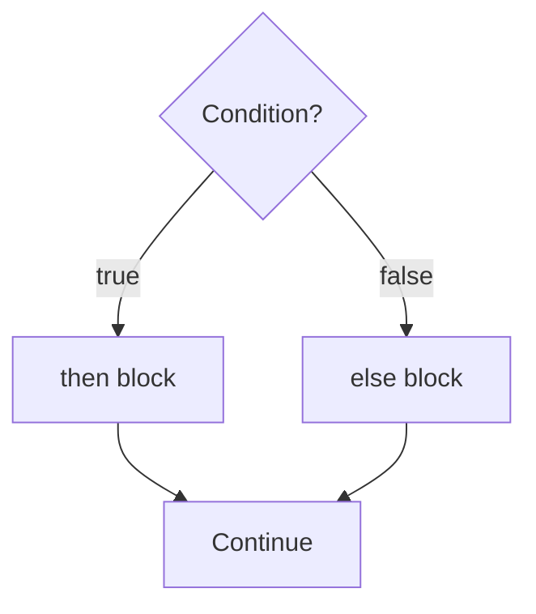

# Control Flow

> [!note] Definition
> Constructs that choose which statements execute based on conditions: `if/else if/else`, `switch`, and the ternary operator.

## if / else if / else
```java
if (x > 0)        { System.out.println("pos"); }
else if (x < 0)   { System.out.println("neg"); }
else              { System.out.println("zero"); }
```

## switch
```java
switch (day) {
    case 1: case 2: case 3: case 4: case 5:
        System.out.println("weekday"); break;
    case 6: case 7:
        System.out.println("weekend"); break;
    default:
        System.out.println("invalid");
}
```
Modern switch expression (Java 14+):
```java
String type = switch (day) {
    case 6, 7 -> "weekend";
    default   -> "weekday";
};
```

> [!tip] When to use switch
> Multiple branches on a **single value** that's an `int`, `String`, `enum`, or `char`. The JVM can compile it to a jump table (O(1)).

## Ternary
```java
int max = (a > b) ? a : b;
```

> [!warning] Pitfalls
> - **Fall-through**: forgetting `break` in a classic `switch` runs the next case too. (Arrow form `->` avoids this.)
> - `switch` doesn't accept `boolean`, `long`, `float`, `double`.
> - Use `.equals()` for `String` in `if`, never `==`.

## Decision flowchart


## `switch` comparison: classic vs arrow
| Feature | Classic `case X:` | Arrow `case X ->` |
|---------|-------------------|-------------------|
| Fall-through | Yes (need `break`) | No |
| Multiple statements | Yes | Must use `{}` block |
| Return value | No | Yes (expression) |
| Multiple constants | `case 1: case 2:` | `case 1, 2 ->` |

## DSA usage
- Binary decisions → ternary or `if`.
- State machines / command parsing → `switch` on `char`/`int`/`String`.
- Avoid deep nesting; early `return` or guard clauses keep code flat.

## Pattern recognition cues
- Branch on a single discrete value → `switch`.
- Range checks / compound conditions → `if/else`.
- Binary choice inline → ternary.

## Related
- [[Loops]] — repeating work · [[Operators]] — boolean expressions
