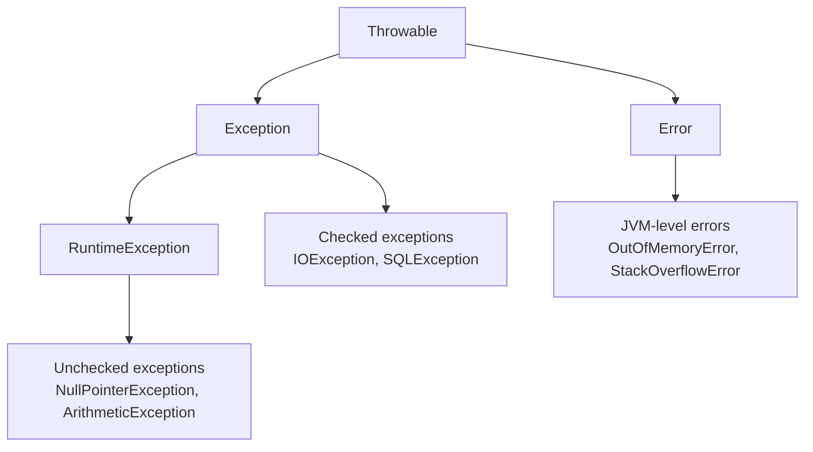

# Exception Basics

> [!note] Definition
> An exception is an object representing a runtime problem. Throwing one unwinds the call stack until a matching `catch` (or the JVM, which prints a stack trace and stops).

## try / catch / finally
```java
try {
    int x = Integer.parseInt(s);
} catch (NumberFormatException e) {
    System.out.println("bad number: " + e.getMessage());
} finally {
    // always runs (even after return/throw) — for cleanup
}
```

## Two families
- **Checked** — subclass of `Exception` (not `RuntimeException`). Compiler forces handling (`try/catch` or `throws`). E.g. `IOException`, `SQLException`.
- **Unchecked** — subclass of `RuntimeException`. Compiler does **not** force handling. E.g. `NullPointerException`, `ArrayIndexOutOfBoundsException`, `ArithmeticException`.

## Throwing & the exception chain
```java
throw new IllegalArgumentException("n must be >= 0");
```
Hierarchy: `Throwable` → `Error` (JVM-level, don't catch) / `Exception` → `RuntimeException`.

> [!tip] Multi-catch (Java 7+)
> ```java
> try { ... }
> catch (IOException | SQLException e) { handle(e); }
> ```

> [!warning] Pitfalls
> - Empty `catch` blocks swallow errors silently — at least log.
> - `finally` runs even if `try` `return`s; a `return` in `finally` overrides the try's return (avoid).
> - Catching `Exception` broadly hides bugs; catch the most specific type you can.

## Exception hierarchy


## try-with-resources (preferred for closeables)
```java
try (BufferedReader br = new BufferedReader(new FileReader("f.txt"))) {
    String line = br.readLine();
} catch (IOException e) {
    e.printStackTrace();
}
// br is closed automatically
```

## Common exceptions in DSA
| Exception | Cause | Prevention |
|-----------|-------|------------|
| `ArrayIndexOutOfBoundsException` | Index outside array | Check `0 <= i < n` |
| `NullPointerException` | Dereference null | Guard or initialize |
| `NumberFormatException` | Bad `parseInt` input | Validate or catch |
| `ArithmeticException` | Divide by zero | Check divisor |
| `StackOverflowError` | Too deep recursion | Convert to iteration |

## Related
- [[Input-Output]] — `throws IOException` explained · [[Exception-Handling]] (full design)
