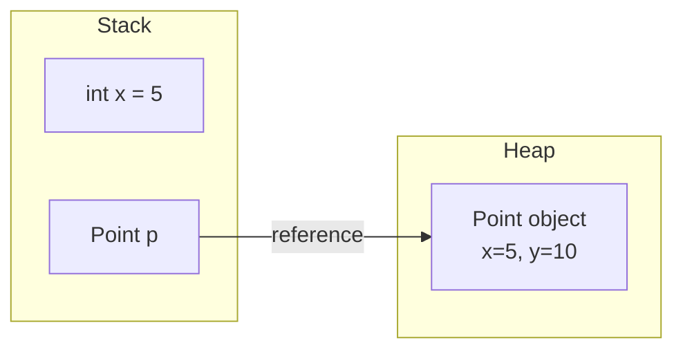

# Variables & Data Types

> [!note] Definition
> Java is **statically typed** — every variable's type is fixed at compile time. Two families: **primitives** (value types, 8 of them) and **reference types** (objects, point to heap).

## The 8 primitives
| Type | Bits | Range | Default |
|------|------|-------|---------|
| `byte` | 8 | -128..127 | 0 |
| `short` | 16 | -32768..32767 | 0 |
| `int` | 32 | -2^31..2^31-1 | 0 |
| `long` | 64 | -2^63..2^63-1 | 0L |
| `float` | 32 | IEEE 754 | 0.0f |
| `double` | 64 | IEEE 754 | 0.0d |
| `char` | 16 | 0..65535 (UTF-16) | '\u0000' |
| `boolean` | 1 | true/false | false |

> [!tip] DSA default choice
> Use `int` for counts/indices, `long` when results may overflow `int` (max ~2.1e9), `double` for ratios.

## Reference types
```java
String s = "hi";        // reference -> heap object
int[] a = {1,2,3};      // reference -> array object
Point p = new Point();  // reference -> object
```

## Wrappers (boxing)
```java
Integer i = 5;          // autoboxing int -> Integer
int j = i;              // unboxing
Integer a = 127, b = 127;  // a == b  -> true  (cached -128..127)
Integer c = 200, d = 200;  // c == d  -> false (use .equals!)
```

## Casting
```java
int x = 9;
double d = x;           // implicit widening (safe)
int y = (int) 3.99;     // explicit narrowing -> 3 (truncates)
```

> [!warning] Pitfalls
> - Integer division: `5 / 2 == 2`, not 2.5. Use `5.0 / 2` or `5 / 2.0`.
> - `NaN` propagates: `0.0/0.0` is `NaN`; use `Double.isNaN(x)`, not `==`.
> - Comparing wrappers with `==` is identity; use `.equals`.

## Stack vs heap for primitives vs references

- Primitive variables store the **value** directly.
- Reference variables store the **address** of an object on the heap.

## Autoboxing cache gotchas
```java
Integer a = 127, b = 127;   // a == b  → true  (cached)
Integer c = 128, d = 128;   // c == d  → false (new objects)
Integer e = -129, f = -129; // e == f  → false (outside cache)
```
Always use `.equals` for wrapper comparison; `==` only works by accident for small cached values.

## Type choice cheat-sheet
| Scenario | Type | Why |
|----------|------|-----|
| Array indices, counts | `int` | Fast, sufficient for most sizes |
| Factorials, large sums | `long` | Avoids `int` overflow |
| Memory-conscious arrays | `byte` / `short` | Smaller footprint |
| Money / precise decimals | `BigDecimal` | `double` has rounding errors |
| Flags / compact storage | `boolean` | 1 bit conceptually |

## Related
- [[Operators]] — how types interact with operators
- [[Strings]] — the most-used reference type
