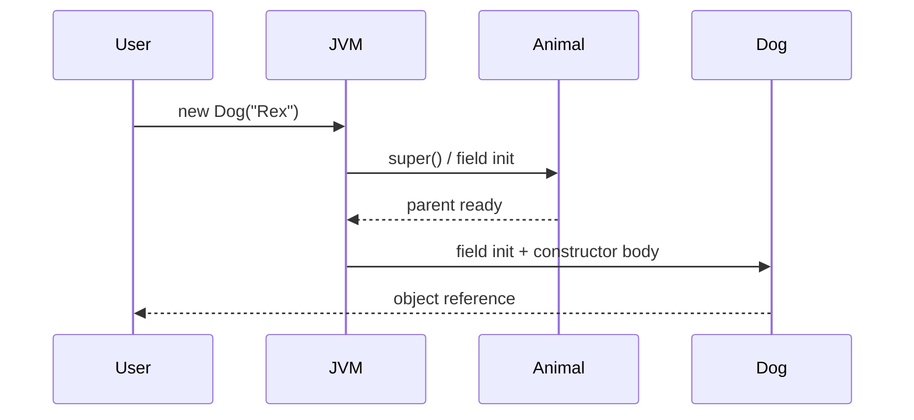

# Constructors

> [!note] Definition
> A constructor is a special block that runs when `new` creates an object. Its job: initialize fields to a valid state. Name = class name; no return type; called once per object.

## Kinds
```java
class Car {
    String model; int speed;

    Car() {                          // 1. default (no-arg)
        this("unknown", 0);
    }
    Car(String model, int speed) {   // 2. parameterized
        this.model = model;
        this.speed = speed;
    }
    Car(Car other) {                 // 3. copy constructor (hand-written)
        this(other.model, other.speed);
    }
}
```

## Constructor chaining
- `this(...)` — call another constructor in the **same** class (must be the first statement).
- `super(...)` — call a parent constructor (must be first; implicit no-arg `super()` if you omit it). See [[Inheritance]].

## Default constructor
- If you write **no** constructor, the compiler inserts a public no-arg one.
- If you write **any** constructor, the default no-arg one **disappears** — add it explicitly if needed.

## Order of initialization
1. Parent constructor (`super`)
2. Field initializers & instance initializer blocks (in source order)
3. The constructor body

> [!tip] Reuse via chaining
> Put the "full" logic in one parameterized constructor; have the others delegate with `this(...)` so validation lives in one place.

## Initialization sequence visualized
When you write `new Dog("Rex")`:



## Copy constructor vs `clone`
| Approach | Pros | Cons |
|----------|------|------|
| Copy constructor `Car(Car c)` | Simple, type-safe | Must write one per class |
| `clone()` | Polymorphic | Verbose, `Cloneable` contract is awkward |
| Copy factory `static Car of(Car c)` | Can return subclass | Less idiomatic |

> [!warning] Shallow copy trap
> A copy constructor copies reference fields verbatim. If the object contains mutable collections/arrays, deep-copy them to avoid shared state surprises.

> [!warning] Pitfalls
> - `this(...)` and `super(...)` can't both appear; and neither can be non-first.
> - A subclass with no constructor still needs its parent to have an accessible no-arg constructor (or you must call `super(args)`).
> - "Constructor" is not a method — no return type, can't be inherited, can't be `abstract`.

## Related
- [[Classes-and-Objects]] · [[this-Keyword]] · [[Inheritance]]
