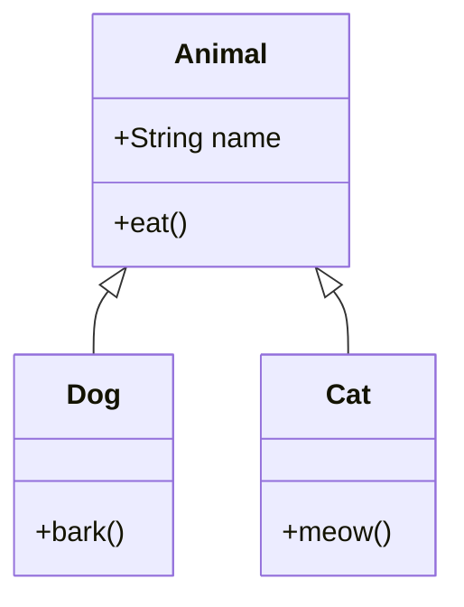

# Inheritance

> [!note] Definition
> Inheritance lets a class acquire fields/methods of another via `extends`, expressing an **IS-A** relationship. Java allows **single** class inheritance (one parent) but multiple interface implementation.

## Syntax
```java
class Animal {
    String name;
    void eat() { System.out.println("eating"); }
}
class Dog extends Animal {
    void bark() { System.out.println("woof"); }
}
Dog d = new Dog();
d.eat();   // inherited
d.bark();  // own
```

## `super`
- `super(args)` — call parent constructor (first statement; implicit no-arg if omitted).
- `super.method()` — call parent's (possibly overridden) method.
```java
class Dog extends Animal {
    Dog(String name) { super.name = name; }   // or super(...) if parent ctor
    @Override void eat() { super.eat(); System.out.println("like a dog"); }
}
```

## Constructor chain on creation
`new Dog()` → `Animal()` runs first → `Dog` field initializers → `Dog` constructor body. Parent is always initialized before child.

## `Object` is the root
Every class implicitly extends `Object` → inherits `toString/equals/hashCode/getClass`. See [[Object-Class]].

> [!tip] IS-A vs HAS-A
> - IS-A → inherit (`Dog` IS-A `Animal`).
> - HAS-A → **composition** (a `Car` HAS-A `Engine` field). Prefer composition for flexibility — [[SOLID-Principles]] (composition over inheritance).

## Class hierarchy diagram


## Method lookup order
When you call `d.eat()` on a `Dog` reference:
1. Check `Dog` for `eat()` → if overridden, use it.
2. Else check parent `Animal`.
3. Else check `Object`.
4. Else `NoSuchMethodError`.

This is the basis of **dynamic dispatch** — see [[Polymorphism]].

## When to use inheritance vs composition
| Inheritance | Composition |
|-------------|-------------|
| True IS-A | HAS-A / uses-a |
| Reusing interface + behavior | Reusing implementation only |
| Parent can be a subtype | Wrap or delegate to helper |
| Risk: fragile base class | Risk: more boilerplate |

> [!warning] Pitfalls
> - Java has **no multiple class inheritance**. Need multiple types → use interfaces ([[Abstraction-and-Interfaces]]).
> - Constructors and `private` members are **not** inherited.
> - A `final` class can't be extended; a `final` method can't be overridden. See [[final-Keyword]].
> - Deep hierarchies are brittle; favor composition + interfaces.

## Related
- [[Constructors]] · [[Polymorphism]] · [[Abstraction-and-Interfaces]] · [[final-Keyword]] · [[Object-Class]]
