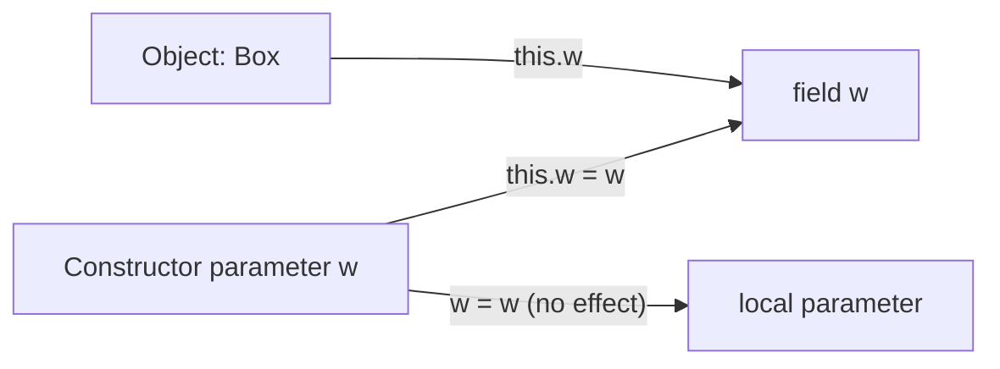

# `this` Keyword

> [!note] Definition
> `this` is an implicit reference to the **current object**, available inside instance methods and constructors. `static` methods have no `this`.

## Three uses

**1. Disambiguate shadowed fields**
```java
class Box {
    int w, h;
    Box(int w, int h) {
        this.w = w;   // this.w = field, w = param
        this.h = h;
    }
}
```

**2. Constructor chaining** — `this(args)` must be the first statement. See [[Constructors]].

**3. Pass self / return self (builder pattern)**
```java
class Builder {
    Builder add(String s) { /*...*/ return this; }
}
Builder b = new Builder().add("a").add("b");   // fluent chain
```

## `this` vs `super`
- `this` → current object. `this.method()` → instance method lookup.
- `super` → parent's version (used to call overridden method from the override). See [[Inheritance]].

> [!tip] Why it matters
> Without `this`, a parameter named the same as a field shadows the field — the assignment `w = w;` would assign the param to itself (no-op). `this.w = w;` fixes it.

## Mental model: `this` is the object's "selfie stick"
Inside an instance method, `this` points at the object that received the message. `static` methods have no receiver, so no `this`.



## Quick reference
| Situation | Code | Meaning |
|-----------|------|---------|
| Shadowed field | `this.x = x;` | field = parameter |
| Chaining | `this(args);` | call sibling constructor |
| Fluent API | `return this;` | return current object |
| In lambda | effectively final `this` | refers to enclosing object |

> [!warning] Pitfalls
> - Can't use `this` in a `static` method or static initializer.
> - `return this` enables mutation chains but hides side effects — use deliberately.

## Related
- [[Constructors]] · [[Classes-and-Objects]] · [[static-Keyword]]
